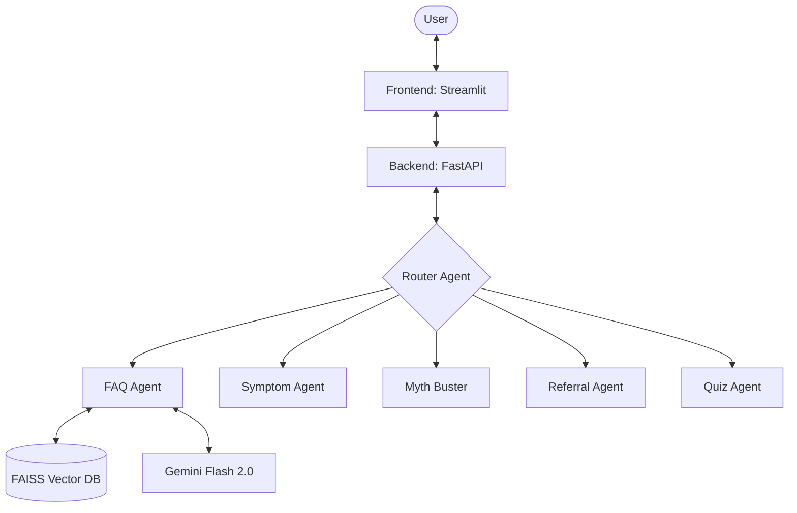

# 🏥 SwasthyaSathi (स्वास्थ्यसाथी)
### AI-Powered Public Health Assistant for India

SwasthyaSathi is a multi-agent AI chatbot designed to provide accessible, accurate, and culturally relevant health information to the Indian public. It leverages a **Hybrid RAG (Retrieval-Augmented Generation)** architecture to combine local medical knowledge with the advanced reasoning of LLMs like Google Gemini.

---

## 🚀 Key Features

- **🧠 Intelligent Routing**: Automatically directs queries to specialized AI agents (Symptoms, Myths, Referrals, etc.).
- **📚 Local Knowledge (RAG)**: Uses FAISS to index local medical data, including Jan Aushadhi medicine prices and Indian health guidelines.
- **⚕️ Symptom Checker**: Preliminary guidance on symptoms with a strong emphasis on professional medical consultation.
- **🛡️ Myth Buster**: Counters common medical misinformation and folk remedies.
- **🏥 Referral System**: Helps users find hospitals and information on affordable medicines.
- **📝 Health Quizzes**: Interactive quizzes to improve public health awareness.
- **🌐 Multi-Channel Support**: Designed to be integrated with WhatsApp, SMS, and Web interfaces.

---

## 🏗️ Architecture



---

## 🛠️ Tech Stack

- **Backend**: Python, FastAPI
- **Frontend**: Streamlit
- **AI Framework**: LangChain
- **LLM**: Google Gemini
- **Vector Database**: FAISS (Local)
- **Embeddings**: Sentence-Transformers (`all-MiniLM-L6-v2`)

---

## ⚙️ Setup Instructions

### 1. Requirements
Ensure you have Python 3.9+ installed.

### 2. Environment Variables
Create a `.env` file in the root directory and add your Google API Key:
```env
GEMINI_API_KEY=your_api_key_here
```

### 3. Installation
```bash
pip install -r requirements.txt
```

### 4. Data Ingestion
Populate the local vector database with health data:
```bash
python scripts/ingest.py
```

---

## 🖥️ Running the Application

### Start the Backend (API)
The backend manages the AI agents and RAG logic.
```bash
uvicorn app.main:app --reload
```
API will be available at: `http://127.0.0.1:8000`

### Start the Frontend (UI)
The frontend provides a WhatsApp-style chat interface.
```bash
streamlit run frontend/app.py
```
UI will be available at: `http://localhost:8501`

---

## 📁 Project Structure

```text
SwasthyaSathi_Demo/
├── app/                  # FastAPI Backend & Agents
│   ├── agents/           # Specialized AI Agent logic
│   ├── main.py           # API Entry point
│   ├── rag.py            # RAG/LangChain Implementation
│   └── router.py         # Query routing logic
├── data/                 # Raw health data & Vector Index
├── frontend/             # Streamlit UI
├── scripts/              # Data ingestion scripts
└── utils/                # Helper functions (Messaging, etc.)
```

---

## ⚠️ Medical Disclaimer

**SwasthyaSathi is for educational purposes only.** It is NOT a substitute for professional medical advice, diagnosis, or treatment. Always seek the advice of your physician or other qualified health provider with any questions you may have regarding a medical condition.

---

Developed with ❤️ for Public Health in India.
